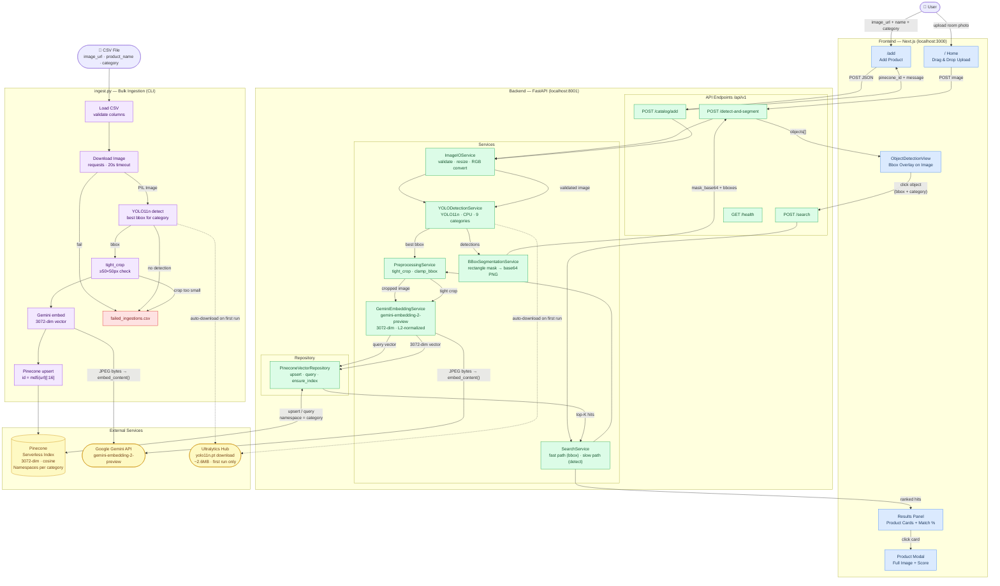

# System Interaction Diagram

```mermaid
flowchart TD
    %% ─── ACTORS ───────────────────────────────────────────────
    USER(["👤 User"])
    CSV(["📄 CSV File\nimage_url · product_name · category"])

    %% ─── FRONTEND ─────────────────────────────────────────────
    subgraph FE["Frontend — Next.js (localhost:3000)"]
        direction TB
        PAGE_HOME["/ Home\nDrag & Drop Upload"]
        PAGE_ADD["/add\nAdd Product"]
        OVERLAY["ObjectDetectionView\nBbox Overlay on Image"]
        PANEL["Results Panel\nProduct Cards + Match %"]
        MODAL["Product Modal\nFull Image + Score"]
    end

    %% ─── BACKEND ──────────────────────────────────────────────
    subgraph BE["Backend — FastAPI (localhost:8001)"]
        direction TB

        subgraph EP["API Endpoints /api/v1"]
            DET["POST /detect-and-segment"]
            SEARCH["POST /search"]
            ADD["POST /catalog/add"]
            HEALTH["GET /health"]
        end

        subgraph SVC["Services"]
            YOLO["YOLODetectionService\nYOLO11n · CPU · 9 categories"]
            PREP["PreprocessingService\ntight_crop · clamp_bbox"]
            BBOX_SEG["BBoxSegmentationService\nrectangle mask → base64 PNG"]
            GEMINI["GeminiEmbeddingService\ngemini-embedding-2-preview\n3072-dim · L2-normalized"]
            IMGIO["ImageIOService\nvalidate · resize · RGB convert"]
            SEARCH_SVC["SearchService\nfast path (bbox) · slow path (detect)"]
        end

        subgraph REPO["Repository"]
            PC["PineconeVectorRepository\nupsert · query · ensure_index"]
        end
    end

    %% ─── INGEST SCRIPT ────────────────────────────────────────
    subgraph SCRIPT["ingest.py — Bulk Ingestion (CLI)"]
        direction LR
        LOAD["Load CSV\nvalidate columns"]
        DL["Download Image\nrequests · 20s timeout"]
        YOLO2["YOLO11n detect\nbest bbox for category"]
        CROP2["tight_crop\n≥50×50px check"]
        EMBED2["Gemini embed\n3072-dim vector"]
        UPSERT2["Pinecone upsert\nid = md5(url)[:16]"]
        FAIL["failed_ingestions.csv"]
    end

    %% ─── EXTERNAL SERVICES ────────────────────────────────────
    subgraph EXT["External Services"]
        PINECONE[("Pinecone\nServerless Index\n3072-dim · cosine\nNamespaces per category")]
        GEMINI_API(["Google Gemini API\ngemini-embedding-2-preview"])
        YOLO_HUB(["Ultralytics Hub\nyolo11n.pt download\n~2.6MB · first run only"])
    end

    %% ─── SEARCH FLOW ──────────────────────────────────────────
    USER -->|"upload room photo"| PAGE_HOME
    PAGE_HOME -->|"POST image"| DET
    DET --> IMGIO
    IMGIO --> YOLO
    YOLO -->|"detections"| BBOX_SEG
    BBOX_SEG -->|"mask_base64 + bboxes"| DET
    DET -->|"objects[]"| OVERLAY
    OVERLAY -->|"click object\n(bbox + category)"| SEARCH
    SEARCH --> SEARCH_SVC
    SEARCH_SVC --> PREP
    PREP -->|"cropped image"| GEMINI
    GEMINI -->|"query vector"| PC
    PC -->|"top-K hits"| SEARCH_SVC
    SEARCH_SVC -->|"ranked hits"| PANEL
    PANEL -->|"click card"| MODAL

    %% ─── ADD PRODUCT FLOW ─────────────────────────────────────
    USER -->|"image_url + name + category"| PAGE_ADD
    PAGE_ADD -->|"POST JSON"| ADD
    ADD --> IMGIO
    IMGIO -->|"validated image"| YOLO
    YOLO -->|"best bbox"| PREP
    PREP -->|"tight crop"| GEMINI
    GEMINI -->|"3072-dim vector"| PC
    ADD -->|"pinecone_id + message"| PAGE_ADD

    %% ─── BULK INGESTION FLOW ──────────────────────────────────
    CSV --> LOAD
    LOAD --> DL
    DL -->|"fail"| FAIL
    DL -->|"PIL Image"| YOLO2
    YOLO2 -->|"no detection"| FAIL
    YOLO2 -->|"bbox"| CROP2
    CROP2 -->|"crop too small"| FAIL
    CROP2 --> EMBED2
    EMBED2 --> UPSERT2
    UPSERT2 --> PINECONE

    %% ─── EXTERNAL CONNECTIONS ─────────────────────────────────
    GEMINI -->|"JPEG bytes → embed_content()"| GEMINI_API
    EMBED2 -->|"JPEG bytes → embed_content()"| GEMINI_API
    PC <-->|"upsert / query\nnamespace = category"| PINECONE
    YOLO -.->|"auto-download on first run"| YOLO_HUB
    YOLO2 -.->|"auto-download on first run"| YOLO_HUB

    %% ─── STYLES ───────────────────────────────────────────────
    classDef frontend fill:#dbeafe,stroke:#3b82f6,color:#1e3a5f
    classDef backend  fill:#dcfce7,stroke:#16a34a,color:#14532d
    classDef external fill:#fef9c3,stroke:#ca8a04,color:#713f12
    classDef script   fill:#f3e8ff,stroke:#9333ea,color:#3b0764
    classDef fail     fill:#fee2e2,stroke:#dc2626,color:#7f1d1d

    class PAGE_HOME,PAGE_ADD,OVERLAY,PANEL,MODAL frontend
    class DET,SEARCH,ADD,HEALTH,YOLO,PREP,BBOX_SEG,GEMINI,IMGIO,SEARCH_SVC,PC backend
    class PINECONE,GEMINI_API,YOLO_HUB external
    class LOAD,DL,YOLO2,CROP2,EMBED2,UPSERT2 script
    class FAIL fail
```
