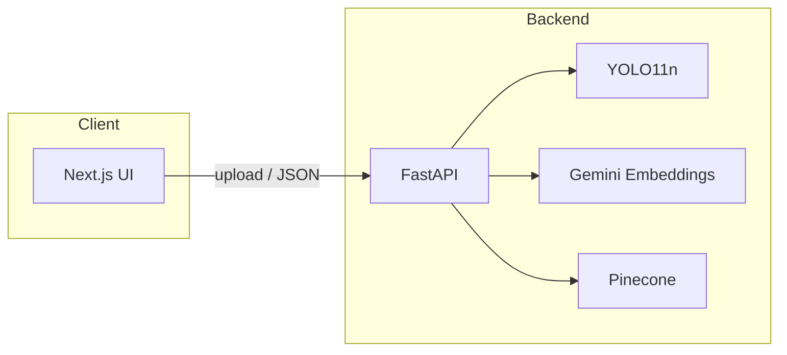

# Interior Visual Search — Class Presentation (Slide Deck Content)

*Speaker notes: Each `##` block is one slide. Export to PowerPoint/Keynote/Google Slides by copying slide titles and bullets, or use a Markdown-to-slides tool (e.g. Marp) if desired.*

---

## Slide 1 — Title

**Interior Visual Search for Product Catalogs**

- Room photo → detect furniture → click an object → ranked similar products
- Stack highlights: **YOLO11n** (detection), **Google Gemini** (image embeddings), **Pinecone** (vector search)
- Implementation: **FastAPI** backend, **Next.js** + **Tailwind CSS** frontend

---

## Slide 2 — Agenda

1. Problem statement and target user
2. System architecture (end-to-end pipeline)
3. **YOLO** — what it does here and why YOLO11n
4. **Gemini embedding model** — vectors, task type, normalization
5. **Pinecone** — index design, namespaces, cosine similarity
6. Catalog ingestion vs. interactive search
7. APIs, data model, and operational concerns
8. Limitations and extensions

---

## Slide 3 — Problem Statement

**Goal:** Support interior e-commerce-style discovery: “find products that *look like* this object in my photo.”

**Challenges addressed:**

- Users do not always describe items in product vocabulary; **visual similarity** is the primary signal.
- The catalog spans **distinct product types** (chairs, sofas, beds, …); search should stay **category-aware**.
- The demo stack should run **without a local GPU** while remaining responsive for class or portfolio demos.

---

## Slide 4 — Solution in One Line

```
Input image → detect objects (YOLO) → crop region → embed image (Gemini) → nearest neighbors (Pinecone) → UI
```

**Idea:** Treat each product image (and each user-selected crop) as a point in a high-dimensional space. **Similar appearance** ≈ **small cosine distance** after embedding.

---

## Slide 5 — Architecture (Conceptual)



- **Frontend** handles upload, optional client-side resize, detection overlay, and results layout.
- **Backend** orchestrates validation, detection, cropping, embedding, and vector I/O.
- **External services:** Google Gemini API (embeddings), Pinecone Cloud (vector index).

---

## Slide 6 — Technology Stack (Implementation)

| Layer | Choice | Role |
|--------|--------|------|
| Object detection | **Ultralytics YOLO11n** | Bounding boxes for COCO-aligned furniture classes; CPU inference |
| Embeddings | **`models/gemini-embedding-2-preview`** | 3072-d multimodal image vectors; `SEMANTIC_SIMILARITY` task |
| Vector DB | **Pinecone** (serverless, v8 SDK) | Cosine metric; upsert + top-*k* query |
| API | **FastAPI** (Python 3.11+) | REST, OpenAPI docs, dependency injection |
| UI | **Next.js** + **React** + **Tailwind CSS** | App Router pages, typed fetch to backend |

*Version note: the frontend `package.json` targets Next.js 16 and React 19; align your spoken “version story” with what you actually run in demo.*

---

## Slide 7 — YOLO (You Only Look Once) — Concepts

**What YOLO is:** A family of **single-stage** object detectors: one forward pass predicts **class labels** and **bounding boxes** at multiple scales. Historically contrasted with two-stage detectors (e.g. R-CNN variants), YOLO trades some fine-grained accuracy for **speed** and simpler deployment.

**Why it fits this project:**

- **Local inference** via Ultralytics — no separate detection microservice required for demos.
- **YOLO11n** (“nano”) is a **small footprint** model (~2.6 MB weights), suitable for **CPU** runs in teaching environments.
- COCO-trained classes include furniture-relevant labels (e.g. chair, couch, bed) that map to **catalog categories**.

**How this codebase uses it:**

- Configurable **confidence threshold** (default 0.15) filters low-confidence boxes.
- Only COCO classes **explicitly mapped** in code become searchable categories; other detections are ignored.

---

## Slide 8 — Google Gemini — Image Embeddings

**Embeddings:** A learned function maps an image (here, a **JPEG crop**) to a **fixed-length vector** (3072 dimensions in this project). Vectors that are **close** under the chosen metric correspond to **visually or semantically similar** content for the configured task.

**Model in use:** `gemini-embedding-2-preview` via the `google-genai` client.

**Task type:** `SEMANTIC_SIMILARITY` — tuned so that dot products / cosine similarity reflect **similarity for retrieval**, not arbitrary auxiliary objectives.

**Implementation details (from the service layer):**

- Crops are encoded as **JPEG** (quality 95) and sent as image parts in a **batch** call when multiple crops exist.
- The service can combine **tight** and **medium** crops: embed each, **average**, then **L2-normalize** — a simple multi-view representation.
- **Retries with exponential backoff** on rate limits, quotas, 429/503, timeouts (bounded attempts).

**Why normalize:** With **cosine similarity** in Pinecone, L2-normalized vectors make inner-product-style scores interpretable as cosine similarity.

---

## Slide 9 — Pinecone — Vector Database

**Role:** Store **catalog embeddings** and answer **approximate nearest neighbor (ANN)** queries at scale.

**Index configuration (this project):**

- **Dimension:** 3072 (must match Gemini output)
- **Metric:** **cosine** — standard for normalized embedding retrieval
- **Deployment:** **Serverless** spec (cloud/region configurable, e.g. AWS + region from env)

**Namespaces = categories:**

- Each **category** (chair, couch, …) maps to a **namespace**.
- Queries target **one namespace**, so retrieval searches **only** relevant product types — improves precision and can reduce latency vs. scanning one flat index.

**Stored payload:**

- **Vector ID:** deterministic from source URL (truncated MD5) → **idempotent upserts** (re-ingest overwrites same id).
- **Metadata:** at minimum `image_url`, `product_name`, `category` for display and debugging.

---

## Slide 10 — Two Pipelines: Ingestion vs. Search

**Catalog ingestion (offline / bulk or admin UI):**

1. Obtain product image (URL download or upload path).
2. Validate image quality (size, contrast, etc.).
3. Run YOLO with **category hint**; select a representative box (largest match or fallback policy).
4. **Tight crop** to bounding box → embed with Gemini → upsert to Pinecone.

**Interactive search (online):**

1. User uploads a **room** photo → **detect all** supported objects → draw boxes in UI.
2. User **clicks** a box → frontend sends **bbox + category** (fast path avoids re-running detection).
3. Crop → embed → Pinecone **top-k** in that category namespace → ranked product cards.

---

## Slide 11 — API Surface (Teaching View)

Representative endpoints (prefix `/api/v1`):

| Method | Path | Purpose |
|--------|------|---------|
| `POST` | `/detect-and-segment` | Run detection; return boxes, scores, optional mask payloads for overlay |
| `POST` | `/search` | Embed crop (with optional bbox) and query Pinecone |
| `POST` | `/catalog/add` | Add one catalog item from JSON (`image_url`, name, category) |
| `GET` | `/health` | Liveness / dependency sanity |

*OpenAPI:* served under `/docs` when the FastAPI app runs — useful for live demos.

---

## Slide 12 — Engineering Choices Worth Mentioning

- **Dependency injection container** — services (image I/O, preprocessing, detection, embedding, Pinecone) wired once at startup; easier testing and swapping implementations.
- **Fast path for search** — passing **precomputed bbox** from the detection step avoids duplicate YOLO work on click.
- **Deduplication** — search results dedupe by vector id while keeping the best score.
- **Image validation** — guards against tiny, blank, or oversized inputs before paid API / vector writes.

---

## Slide 13 — Limitations & Honest Scope (Good for Q&A)

- **Category coverage** is limited to the **mapped COCO subset**; arbitrary objects are not supported without extending mappings or the detector.
- **Detection ≠ segmentation** in this YOLO path — masks may be bbox-derived for visualization; fine contour segmentation is out of scope.
- **Embedding API costs and latency** scale with traffic; batching and caching are typical production extensions not shown in minimal demo code.
- **Fairness / bias:** commercial embedding models can encode biases present in training data — relevant if discussing responsible AI.

---

## Slide 14 — Possible Extensions (Discussion Starters)

- Swap or ensemble embeddings (e.g. compare Gemini vs. open-weight image encoders).
- Add **metadata filters** in Pinecone (price band, style tags) on top of vector search.
- **Hybrid search:** combine keyword/BM25 with dense vectors for skewed catalogs.
- **Active learning:** log low-score queries to improve catalog tagging and cropping policies.

---

## Slide 15 — Demo Checklist

- Backend: `uvicorn` on configured port; `.env` with **Pinecone** + **Google** keys; index **3072-dim, cosine**.
- Frontend: `npm run dev`; confirm API base URL matches backend.
- Seed catalog: UI “add product” or `ingest.py` CSV flow.
- Live path: upload room photo → boxes appear → click chair → results populate.

---

## Slide 16 — References (for bibliography slide)

- Ultralytics YOLO documentation — [https://docs.ultralytics.com/](https://docs.ultralytics.com/)
- Google AI / Gemini API — [https://ai.google.dev/](https://ai.google.dev/)
- Pinecone documentation — [https://docs.pinecone.io/](https://docs.pinecone.io/)
- FastAPI — [https://fastapi.tiangolo.com/](https://fastapi.tiangolo.com/)
- Next.js — [https://nextjs.org/docs](https://nextjs.org/docs)

---

*End of deck content.*
